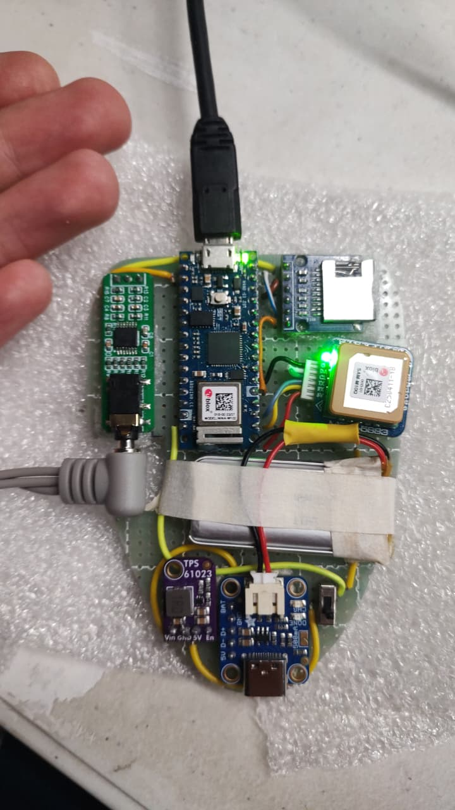

# 🏃‍♂️ Sistema de Monitoreo Deportivo Wearable 🏃‍♀️

¡Bienvenido al repositorio del **Sistema de Monitoreo Deportivo**! Este proyecto es un dispositivo wearable basado en Arduino Nano IoT, diseñado para registrar y analizar métricas clave durante el ejercicio físico, como la frecuencia cardíaca, la velocidad y la distancia recorrida.



## ✨ Características Principales

- **Análisis de Frecuencia Cardíaca (ECG)**: Detección de picos R y cálculo de BPM en tiempo real.
- **Seguimiento GPS**: Registro de velocidad, distancia y ubicación.
- **Zonas de Entrenamiento**: Clasificación del esfuerzo en zonas de frecuencia cardíaca y velocidad.
- **Métricas Avanzadas**: Cálculo de TRIMP (Training Impulse) para medir la carga de entrenamiento.
- **Almacenamiento de Datos**: Guardado de sesiones en una tarjeta SD en formato CSV.
- **Diseño Modular**: Código organizado en módulos para facilitar la mantenibilidad y escalabilidad.

## 📂 Estructura del Proyecto

El código está organizado de forma modular para una máxima claridad y reutilización.

```
/media/adrian/sd_linux/embebidos/MCUs/platformios/arduino-nano-iot/wearable-sport/
├── include/              # Archivos de cabecera (.h)
│   ├── config.h
│   ├── filter.h
│   ├── gps_processing.h
│   ├── heart_rate.h
│   ├── heart_rate_zones.h
│   ├── metrics.h
│   ├── sd_card.h
│   └── velocity_zones.h
├── src/                  # Archivos de implementación (.cpp)
│   ├── main.cpp
│   ├── filter.cpp
│   ├── gps_processing.cpp
│   ├── heart_rate.cpp
│   ├── heart_rate_zones.cpp
│   ├── metrics.cpp
│   ├── sd_card.cpp
│   └── velocity_zones.cpp
├── lib/                  # Bibliotecas externas
├── test/                 # Pruebas (si aplica)
├── platformio.ini        # Archivo de configuración de PlatformIO
└── README.md             # ¡Estás aquí!
```

## 🛠️ Módulos del Sistema

| Módulo                 | Descripción                                                                                             |
| ---------------------- | ------------------------------------------------------------------------------------------------------- |
| `main.cpp`             | Orquesta el sistema: inicializa los módulos y gestiona el bucle principal.                              |
| `config.h`             | Centraliza todas las constantes y pines de configuración del hardware.                                  |
| `filter.h/cpp`         | Implementa un banco de filtros biquad en cascada para limpiar la señal de ECG.                          |
| `heart_rate.h/cpp`     | Contiene el algoritmo de detección de picos R para calcular los intervalos RR y los BPM.                |
| `gps_processing.h/cpp` | Procesa los datos NMEA del GPS para obtener velocidad, distancia y hora UTC.                              |
| `velocity_zones.h/cpp` | Clasifica la velocidad actual en zonas predefinidas (caminar, trotar, correr, sprint).                  |
| `heart_rate_zones.h/cpp` | Clasifica los BPM actuales en zonas de esfuerzo (Z1 a Z6) basadas en la FC máxima.                      |
| `metrics.h/cpp`        | Calcula métricas de rendimiento como la distancia total, TRIMP y detecta sprints.                        |
| `sd_card.h/cpp`        | Gestiona la creación y escritura de archivos CSV en la tarjeta SD para el registro de datos.            |

## 🌊 Flujo de Datos

El sistema sigue un flujo de procesamiento claro y eficiente:

El sistema sigue un flujo de procesamiento claro y eficiente:

1.  **Señal ECG (30 Hz)**: Se filtra y se procesa para la detección de picos R.
2.  **Detección de Picos R**: Calcula los intervalos RR y los BPM.
3.  **Datos GPS (1 Hz)**: Se procesan para obtener velocidad, distancia y hora UTC.
4.  **Cálculo de Métricas**: Utiliza los BPM, velocidad y distancia para calcular métricas como TRIMP y detectar sprints.
5.  **Almacenamiento en SD**: Los datos procesados se guardan en la tarjeta SD cada 60 segundos.

## 🚀 Cómo Empezar

Este proyecto está configurado para **PlatformIO**, un ecosistema profesional para el desarrollo de software embebido.

1.  **Instalar PlatformIO**: Sigue las instrucciones en [platformio.org](https://platformio.org/).
2.  **Clonar el Repositorio**: `git clone <URL_DEL_REPOSITORIO>`
3.  **Instalar Dependencias**: PlatformIO gestionará automáticamente las bibliotecas listadas en `platformio.ini`.
4.  **Compilar y Subir**: Conecta tu Arduino Nano IoT y usa los comandos de PlatformIO para compilar y subir el firmware.

## ✅ Ventajas del Diseño Modular

-   **Mantenibilidad**: Cada módulo tiene una única responsabilidad, facilitando su depuración y mejora.
-   **Reutilización**: Los componentes como el filtro o el gestor de SD pueden ser fácilmente adaptados a otros proyectos.
-   **Testing**: Permite realizar pruebas unitarias de forma aislada para cada módulo.
-   **Legibilidad**: Un código bien estructurado es más fácil de entender y navegar.
-   **Colaboración**: Facilita el trabajo en equipo, permitiendo que varios desarrolladores trabajen en paralelo.

---

Hecho con ❤️ y código limpio.